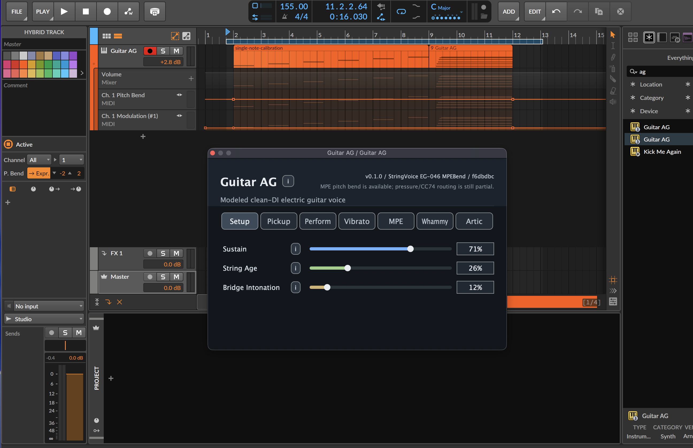

# Guitar AG

Guitar AG is an experimental **source-available physical-model electric guitar VST3 instrument** with **MPE** support, built with **C++**, **JUCE**, and **CMake**.

It is **not sample based**. It synthesizes a clean DI-style electric guitar voice from modeled string behavior, pickup readout, and performance controls. The goal is a lightweight virtual instrument that can sit before a normal amp/cab simulator and respond more like a playable guitar-style synth than a static sample library.

If you have been looking for a small modeled alternative to multi-gigabyte sampled guitar libraries, this project is exploring that space: independent modeled string voices, guitar-like articulation, MPE per-note pitch bend/expression, and a DI output designed for external amp sims.

It can be played as a performance instrument, but the original need was composition: writing guitar parts in a DAW piano roll without relying on keyswitches. Guitar AG favors automatable parameters, MPE/note-expression lanes, and a controllable amount of built-in player interpretation so guitar-like bends, pressure, timbre, legato, muting, pickup movement, and feedback can be drawn or automated over time.

Search terms this project intentionally fits:

```text
physical modeling guitar VST3, modeled electric guitar plugin, MPE guitar synth,
virtual guitar instrument, JUCE audio plugin, sample-free guitar VST,
piano-roll guitar composition, keyswitch-free guitar articulation
```

The project is also a practical example of AI-assisted audio plugin development: a human musician/developer gave listening feedback in Bitwig, while Codex iterated on DSP, UI, build tooling, documentation, analysis scripts, and versioned VST3 builds in small testable steps.

## Current Status

The current build is a working VST3 instrument with macOS and Windows release assets.

Implemented so far:

- Polyphonic modeled string voices.
- Clean DI-style electric guitar tone.
- Standard MIDI note on/off and velocity.
- Fretboard/string assignment heuristic.
- Pickup type and pickup position controls.
- Pick stiffness and pick texture controls.
- Palm mute, harmonic touch, string age, sustain, bridge intonation, and fret pressure controls.
- Lookahead finger-noise mode for rendered playback.
- Finger vibrato controls with optional mod-wheel routing.
- Global pitch-wheel whammy mode.
- Per-note key/poly aftertouch bend.
- First MPE pitch-bend milestone: one held note can bend independently while other notes remain stable, provided the DAW sends notes on separate MPE member channels.
- MPE/channel expression routing for pressure and CC74/timbre, scoped to the matching MIDI channel/voice.
- Player-articulation interpretation for picked notes, hammer-ons, pull-offs, and right-hand taps.
- `Amp Feedback` control with a global dominant-band feedback loop for controlled harmonic takeover.
- Dedicated feature-audition and player-articulation MIDI clips plus offline render tooling.

Current model label:

```text
StringVoice EG-050 FeedbackLoop
```

## Demo



Short MP3 render from an earlier modeled guitar voice:

<audio controls src="assets/demo/guitar-ag-demo-2026-04-27.mp3"></audio>

[Download or play the MP3 demo](assets/demo/guitar-ag-demo-2026-04-27.mp3)

Planned demo clips:

- Clean DI modeled guitar demo: coming soon at `assets/demo/guitar-ag-v0.2.0-clean-di.mp3`.
- Amp-sim context demo: coming soon at `assets/demo/guitar-ag-v0.2.0-through-amp-sim.mp3`.
- MPE independent bend demo: coming soon at `assets/demo/guitar-ag-v0.2.0-mpe-bend.mp3`.
- Player articulation demo with hammer-ons, pull-offs, and taps: coming soon at `assets/demo/guitar-ag-v0.2.0-articulation.mp3`.
- Amp feedback takeover demo: coming soon at `assets/demo/guitar-ag-v0.2.0-feedback.mp3`.

The most useful first demos are short, dry, and direct: a clean DI clip that proves the plugin is not a sample library, and an MPE clip where one held chord tone bends while the others stay fixed.

## Why This Exists

Many virtual guitar instruments rely on large sample libraries, keyswitch maps, or fixed articulation sets. Guitar AG explores a different direction: a compact physical model with continuous controls for the in-between behaviors that are hard to cover with samples.

The motivating question is simple:

> What if an expressive electric guitar VST could be modeled instead of sampled, small enough to download quickly, and easy to compose with directly in a piano roll using notes, automation, and MPE expression instead of keyswitch-heavy sample programming?

The instrument is meant to be performance-capable, but it is especially aimed at authored parts: write the notes, draw or record the expressive curves, then let the model add a tunable amount of guitar-player interpretation. `Legato Articulation` is one example: at low values it stays closer to picked-note playback; at higher values it can interpret eligible note transitions as hammer-ons, pull-offs, or taps.

The first major success condition was:

> Hold a chord and bend one note independently with MPE while the other notes stay put.

That milestone is now implemented.

The current frontier is more musical than infrastructural: turning ordinary MIDI notes into plausible guitar-player gestures, and giving the modeled strings enough amp-adjacent behavior that feedback and sustain can become part of the performance instead of only a post-effect.

Perfect guitar realism is not claimed. This is a playable research instrument, a useful DI tone source, and a living example of how an AI-assisted development loop can move from idea to working VST3.

## Quick Start

### macOS

Prerequisites:

- CMake 3.22 or newer.
- Apple Command Line Tools or Xcode.
- Git.
- A local JUCE checkout.

Example setup:

```bash
git clone https://github.com/juce-framework/JUCE.git ~/code/JUCE
git clone https://github.com/ArneGleason/guitar-ag.git
cd guitar-ag
cmake -S . -B build -DJUCE_PATH=~/code/JUCE -DCMAKE_BUILD_TYPE=Release
cmake --build build --config Release --target GuitarAG_VST3
```

Install to the user VST3 folder:

```bash
scripts/install-vst3.sh --build
```

Installed location:

```text
~/Library/Audio/Plug-Ins/VST3/Guitar AG.vst3
```

### Windows

Windows builds should be made on Windows.

Prerequisites:

- Visual Studio 2022 or Visual Studio Build Tools with MSVC C++ tools.
- CMake.
- Git.
- A local JUCE checkout.

Example PowerShell flow:

```powershell
git clone https://github.com/juce-framework/JUCE.git C:\code\JUCE
git clone https://github.com/ArneGleason/guitar-ag.git
cd guitar-ag
cmake -S . -B build -DJUCE_PATH=C:\code\JUCE
cmake --build build --config Release --target GuitarAG_VST3
```

Typical Windows VST3 install location:

```text
C:\Program Files\Common Files\VST3\
```

Cross-compiling a Windows VST3 from macOS is not the recommended path. JUCE/CMake keeps the source portable, but VST3 binaries are platform-specific and are easiest to build and test on the target OS.

## Releases And Downloads

Compiled plugin binaries should be distributed through **GitHub Releases**, not committed directly into the repository.

Current release assets:

- `Guitar-AG-macOS-v0.2.0.zip`
- `Guitar-AG-v0.2.0-Windows-VST3.zip`

Future release assets should use consistent names:

- `Guitar-AG-vX.Y.Z-macOS-VST3.zip`
- `Guitar-AG-vX.Y.Z-Windows-VST3.zip`

Release packaging can be automated later with GitHub Actions so macOS and Windows builds are attached automatically to tagged releases.

Download the latest release from:

```text
https://github.com/ArneGleason/guitar-ag/releases
```

## MPE Setup Notes

In the plugin UI:

- Enable `MPE Mode`.
- Leave `MPE Bend Range` at `48.0 st` for Bitwig's default MPE pitch-expression range.
- Use `MPE Pressure Amount` and `MPE CC74 Amount` to scale per-note pressure/timbre response.

In the DAW:

- Enable MPE/note expression for the instrument track.
- Match the DAW note-expression pitch range to the plugin's `MPE Bend Range`.

If the DAW and plugin ranges disagree, a drawn two-semitone bend will not sound like two semitones. This is why the bend range is visible in the UI.

## Feature Audition MIDI

The repo includes structured MIDI audition clips:

```text
tests/midi/guitar-ag-feature-audition.mid
tests/midi/guitar-ag-player-articulation-audition.mid
```

The feature-audition file walks through open strings, velocity dynamics, strummed chords, short releases, mod-wheel vibrato, key/poly aftertouch, MPE pitch bend, MPE pressure, and MPE CC74.

The player-articulation file focuses on guitar-like arpeggios, hammer-on and pull-off candidates, mixed legato phrases, and right-hand tapping patterns. It is useful for testing `Legato Articulation` from 0% through 100%.

See `docs/audition-midi.md` for the bar-by-bar guide, suggested plugin setup, and offline A/B examples.

## Offline Render Tool

The repo includes a command-line renderer that uses the same `AudioEngine` as the plugin. This made it possible to run quick experiments without opening a DAW.

Example:

```bash
cmake --build build --config Release --target GuitarAGOfflineRender

build/GuitarAGOfflineRender_artefacts/Release/GuitarAGOfflineRender \
  --midi tests/midi/single-note-calibration.mid \
  --output build/diagnostics/guitar-ag-test.wav \
  --sample-rate 48000 \
  --block-size 512 \
  --tail-seconds 2.0 \
  --legato-articulation 1.0 \
  --amp-feedback 0.75
```

The offline renderer is useful for DSP comparison and regression checks. It does not replace testing the VST3 in a real host such as Bitwig, Reaper, Ableton Live, or another DAW.

## Development Process

We started with a rough idea: a lightweight physical-model electric guitar VST that could act as a clean DI instrument without samples, then built it in small auditionable steps. First we made the JUCE/CMake VST3 shell and a simple plucked string, then repeatedly listened, measured, and adjusted the model through pickup behavior, sustain, wound/plain string character, pick stiffness and texture, palm muting, harmonics, string age, intonation, fret pressure, finger noise, vibrato, whammy behavior, aftertouch bend, MPE per-note pitch bend, and MPE pressure/CC74 expression.

The newest iteration added a phrase-aware player-articulation layer and a first amp-feedback model. `Legato Articulation` interprets eligible note transitions as pull-offs, hammer-ons, or right-hand taps with distinct excitation profiles. `Amp Feedback` now combines local string sustain with a small global feedback resonator loop, so high settings can let one harmonic band begin to dominate rather than evenly boosting every string.

The process is very "warmer/colder": Codex makes a narrow hypothesis and builds it, the human tests in Bitwig and gives musical feedback, and the project keeps or redirects each experiment based on what actually sounds convincing. The repo has grown from documentation and an empty shell to a buildable, installed, versioned VST3 with real-time modeled guitar-like sound, useful performance controls, offline render tooling, and the core MPE goal working: independent pitch and expression control for notes via MPE.

## By The Numbers

As of the `EG-050 FeedbackLoop` milestone:

- Git commits before this milestone commit: 69.
- Model checkpoints documented or build-labeled: 50.
- VST parameters: 26.
- Editor pages: Setup, Pickup, Perform, Vibrato, MPE, Whammy, and Artic.
- Plan files: 58, including player articulation and feedback-loop plans.
- Audition MIDI files: feature audition, player-articulation audition, single-note calibration, and velocity ladder.
- Offline renderer flags now cover core tone controls, MPE expression, legato articulation, and amp feedback.

## Repo Guide

- `src/dsp/` — audio engine, string voice, pickup/tone stage, fretboard mapper.
- `src/plugin/` — JUCE processor and editor.
- `tools/` — offline render tool.
- `scripts/` — analysis, MIDI generation, reference-data, and install helpers.
- `docs/requirements.md` — product requirements.
- `docs/architecture.md` — component boundaries.
- `docs/mpe-behavior.md` — MPE behavior and routing notes.
- `docs/dsp-notes.md` — DSP experiments and listening notes.
- `docs/realism-vision.md` — longer-term research direction.
- `docs/build-notes.md` — build and install details.
- `plans/` — milestone-by-milestone implementation plans.
- `DECISIONS.md` — accepted decisions.
- `LEARNINGS.md` — accumulated project memory.

## Contributions And Feedback

Guitar AG is early and experimental. The most useful feedback right now is practical and specific:

- Does the VST3 load in your DAW?
- Does it produce clean output at normal levels?
- Does MPE pitch bend affect only the intended note?
- Do MPE pressure and CC74/timbre affect the intended voice?
- Which controls feel musically useful, and which ones feel synthetic or confusing?
- Are the automatable controls useful for piano-roll composition without keyswitches?
- Do the Mac and Windows release zips install cleanly?
- Are there DSP, guitar-performance, or JUCE/plugin-hosting bugs worth fixing first?

Good contribution areas:

- DAW compatibility checks in Bitwig, Reaper, Ableton Live, and other VST3 hosts.
- MPE controller testing with LinnStrument, Seaboard, Push, Osmose, or other expressive controllers.
- Short demo clips and MIDI test cases.
- Real-time-safe DSP improvements.
- Build packaging and GitHub Actions automation.

## Non-Goals

For now, Guitar AG does not aim to be:

- A sample library.
- A full amp/cab/effects suite.
- A perfect named guitar emulation.
- A finished commercial-grade release.
- A complete MPE implementation for every possible zone/master-channel edge case.

The current aim is simpler and more fun: a compact modeled electric guitar instrument that is playable, inspectable, hackable, and useful enough to keep improving.

## License

No explicit license has been added yet. Treat the code as private/all-rights-reserved until a license file is added.
